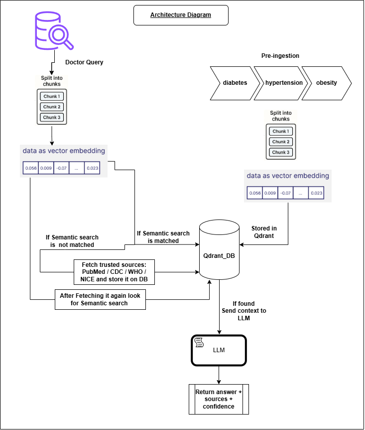

# RagMedic – Clinical RAG Assistant

A Retrieval-Augmented Generation (RAG) medical assistant that provides trusted, source-backed, low-hallucination answers using official healthcare sources.

## 🚀 Features

- JWT Authentication (Doctor / Admin roles)
- RAG-powered clinical question answering
- Source-backed responses
- Trusted sources:
  - CDC
  - WHO
  - NICE
  - PubMed
- Confidence scoring (High / Medium / Low)
- Query history tracking
- Admin ingestion panel
- Auto-ingestion when data missing
- Mobile-friendly React UI

---

## 🧠 How It Works

1. User asks a medical question
2. Query converted into embeddings
3. Qdrant retrieves relevant chunks
4. If context missing:
   - Fetch from CDC / WHO / NICE / PubMed
5. Retrieved context sent to Ollama LLM
6. LLM generates grounded answer only from retrieved sources

---

## 🏗 Architecture




---

## 🛠 Tech Stack

### Backend
- FastAPI
- SQLAlchemy
- JWT Auth

### AI / ML
- Sentence Transformers
- Qdrant
- Ollama
- RAG Pipeline

### Frontend
- React (Vite)
- Tailwind CSS

---

## 📂 Project Structure

```bash
app/
├── main.py
├── config.py
├── database.py
├── models.py
├── auth/
├── rag/
│   ├── retriever.py
│   ├── generator.py
│   ├── embeddings.py
│   ├── qdrant_store.py
│   ├── confidence.py
│   └── gate.py
├── ingestion/
│   ├── website_ingestor.py
│   ├── auto_ingestor.py
│   ├── seed_data.py
│   ├── chunker.py
│   └── loaders/

frontend/
├── src/
├── App.jsx
└── api.js
